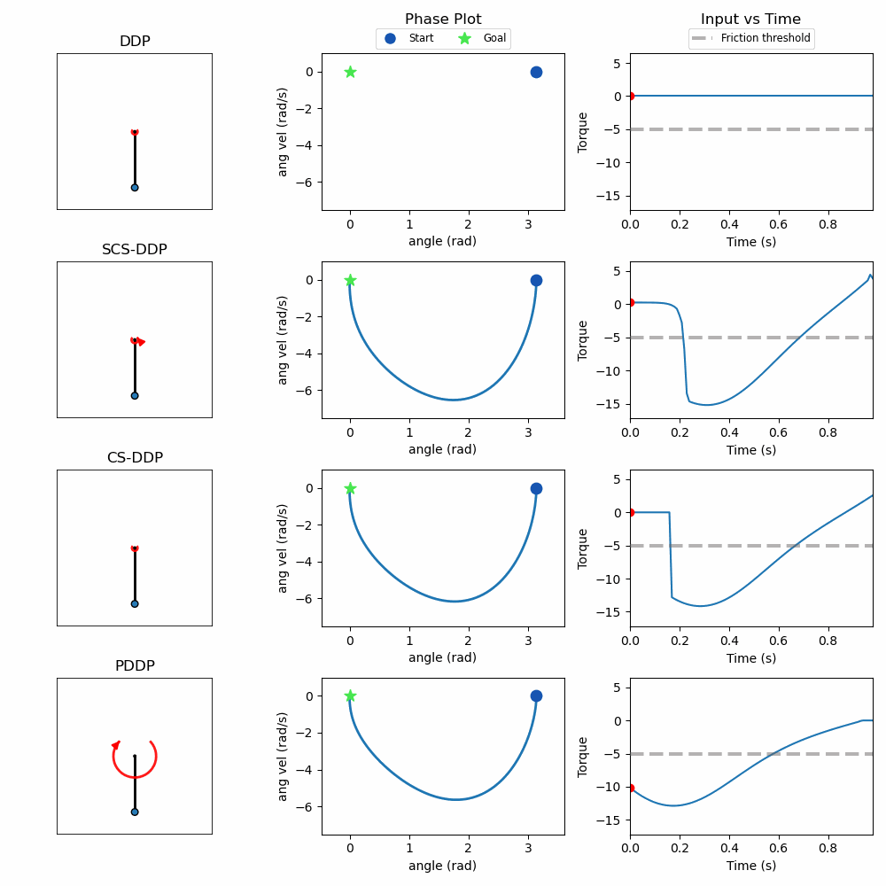

Trajectory Optimization for non-smooth systems in robotics, using the idea of (randomized) smoothing from non-smooth optimization.

To get started, create environment using:
```
conda env create -f environment.yml
```
and run the examples from ./examples

## Simulation Results

Below are results on some simple use-cases:

- 1D Box Push — 1D box constrained to move along a single axis with dry Coulomb friction

  

- Pendulum Swing Up — Pendulum with joint friction

  

- Cartpole Swing Up — Cartpole with joint friction at the pole–cart joint

  

