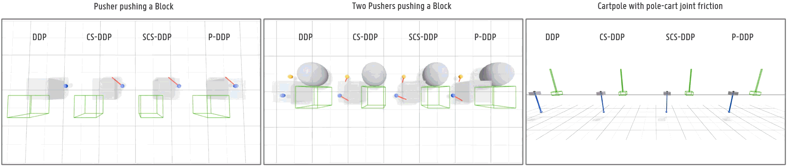

Trajectory Optimization for non-smooth systems in robotics, using the idea of (randomized) smoothing from non-smooth optimization.

To get started, create environment using:
```
conda env create -f environment.yml
```
and run the examples from ./examples

## Simulation Results

:
